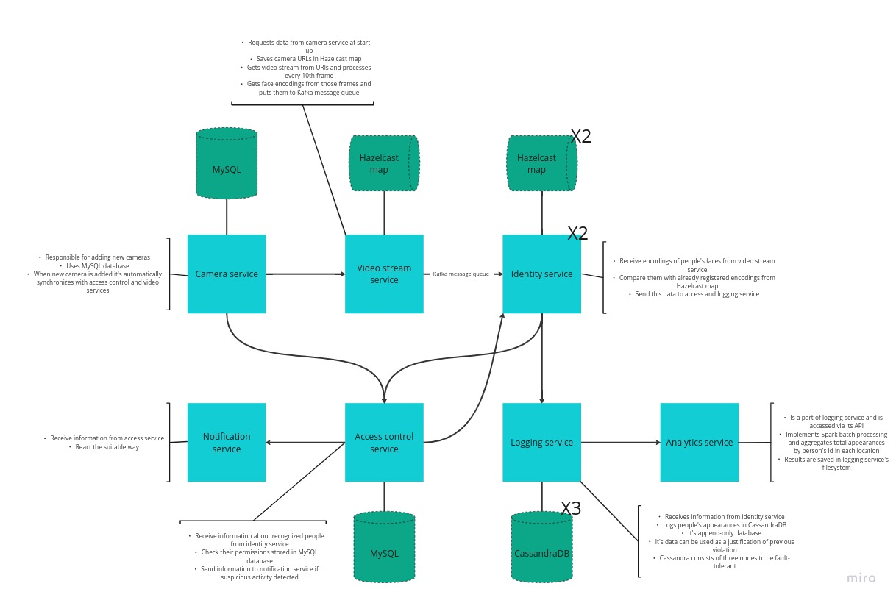

# Security system

## Vision

This project is a security system which detects people that appear on cameras. User can save pre-made list of people and their permissions to be on certain locations. Also the system will detect unknown people and report them as well. 

## Use cases

- Security system in universities that check so only students, proffesors and other employees can access academic spaces, laboratories etc.
- Shops also can use such systems, where employees can have access to the shop and storage, while all the customers (unknown people) are only allowed on the shopping floor
- Any other office, building that might need to control who are entering the buildings and certain locations

## System structure

This system consists of seven microservices, three databases and 2 in-memory storages.
 
Here is their descriprion:

- ### Camera service
With this microservice users can add new cameras that will be used for detecting people. While adding a new camera, the user should describe:
- camera_id: the id that is usually written on the camera (now in the code we use uuid form instead but it is not generated automatically); 
- url: camera's url with which the system can connect to the camera ("http://100.64.131.127:8080/video" to connect with IP Webcam on an Android phone or "/dev/video0" to connect with the computer's camera);
- location: location of the camera;
- is_active: this parameter (for example, the camera can be saved in the system but is not used now, so its is_active parameter is False; only active cameras are sent to video stream service);

Camera service uses MySQL database to store information about cameras. Whenever the user adds a new camera, it is automatically synchronized with video stream and access control services (with POST requests to these microservices).

- ### Video stream service
At the start, this microservice makes a GET request to the camera service to synchronize all cameras that are in the MySQL database of the camera service. Video stream microservice saves all camera_ids and urls of active cameras with Hazelcast map to not make a GET request to camera service all the time. And any changes in the MySQL database of the camera service are synchronized with the Hazelcast map of the video stream service.

Video stream service iterates over all urls and processes every 10th frame of each camera. It retrieves frame encodings from them and adds them to the Kafka message queue with the camera_id of the camera from which the frame was taken and with timestamps. These encodings will be used by identity service to analyze who was in the frame of the specific camera at the specific time.

- ### Identity service

This microservice is responsible for getting people's names that were detected on a video by Video service. 
The Video service retrieves encodings of people's faces from a video and sends them to the Identity service via Kafka message queue. On Identity serivice they are compared to the registered encodings that are stored in Hazelcast map. If the person is unknown, it is added to Hazelcast map and marked as unknown. Then this information (UUID of a person, camera id where they were detected, time) are sent to both access service and logging service.


- ### Access control service

This microservice accepts POST requests with image of a person, their name, location and their permission to be there. For each person the UUID is generated and each person is then sent to Identity service via POST request (UUID, encoding). It accepts GET request from Identity service with UUID of detected people and time when it happened and camera id, on which they were detected. Then Acces control service makes POST request to Notification service, when firbidden or unknown people were detected.


- ### Notification service

This service receives information from access service about forbidden and unknown people and reacts to that the suitable way. Right now it just tells the user about such incidents, but it can be adjusted for a particular problem.

- ### Logging service

Logging service logs appearances sent from identity service into Cassandra, which uses `DateTieredCompactionStrategy`
and acts as an append-only logging database. Its purpose is to save when and where each person appeared on cameras, so
later those logs can be used to calculate statistics of appearances of certain people in given locations. As it can also
be used as a tool for justification of previous access violations, it must be fault-tolerant to retain all the
information. Therefore, it consists of three nodes and has a full replication factor of three, so each node contains all
logged appearances.

To make it possible to access the raw logs, logging service exposes the following list of GET endpoints on port `8004`:
- `/appearances_by_person_id/{person_id}`
- `/{day}` - all appearances in a given day
- `/appearances_by_person_id/{person_id}/{day}`
- `/appearances_by_location/{location}`
- `/appearances_by_location/{location}/{day}`
- `/appearances_by_camera_id/{camera_id}`
- `/appearances_by_camera_id/{camera_id}/{day}`

But the data is also regularly processed, which will be described in the next part. The POST `/` endpoint is mainly used
by identity service to store new appearances. Also, this service has a simple healthcheck endpoint that is used by
Docker Compose.

- ### Analytics service

This is not a service per se, as its results are accessed through the logging service API and are. It is a Spark batch
processing job that runs with interval of one minute and aggregates the total appearances by person's id in each
location. The results can be accessed by GET on `/` on the port of loggin service (`8004`). Example response:

```json
{
  "entrance": [
    {
      "e2fa737d-2480-4c6e-bc9c-38565644435e": 3
    },
    {
      "180b849c-2eaf-4c21-8d55-0e5073abe60f": 5
    }
  ],
  "office": [
    {
      "e2fa737d-2480-4c6e-bc9c-38565644435e": 12
    }
  ]
}
```

Also, the results are stored in logging service's filesystem, so they can be accessed from docker volume on the host
machine in the `results` subdirectory of `logging_service`. Although they will be in a less readable format, as spark
saves each json as a separate row

```json
{"location":"entrance","person_id":"e2fa737d-2480-4c6e-bc9c-38565644435e","total_appearances":3}
{"location":"entrance","person_id":"180b849c-2eaf-4c21-8d55-0e5073abe60f","total_appearances":5}
{"location":"office","person_id":"e2fa737d-2480-4c6e-bc9c-38565644435e","total_appearances":12}
```


## Diagram



## Team 

- [Mykhailo Sobko](https://github.com/myrimur): Logging service, Analytics service
- [Karyna Volokhatiuk](https://github.com/karyna-volokhatiuk): Camera service, Video stream service
- [Daria Minieieva](https://github.com/DariaMinieieva): Access control service, Identity service, Notification service

